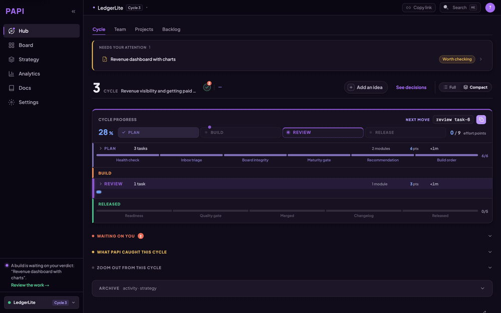
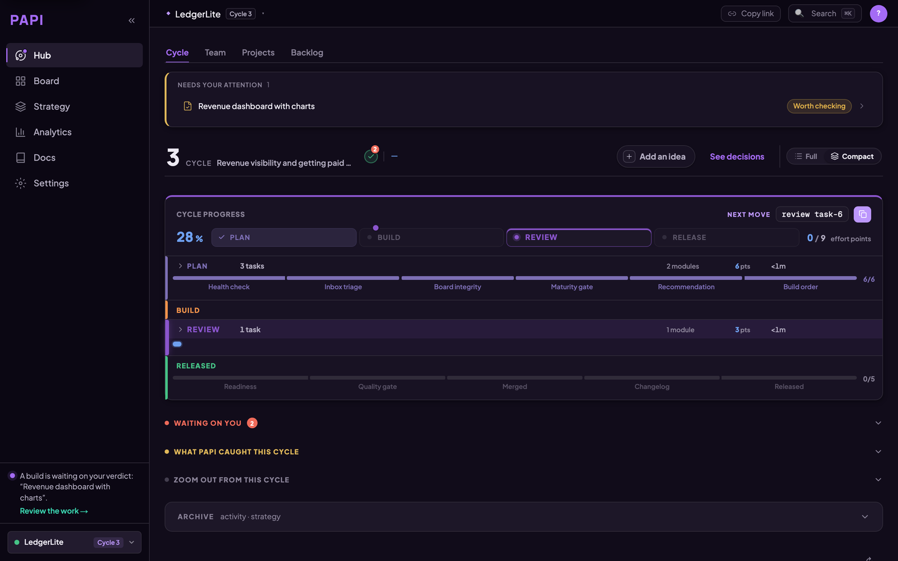
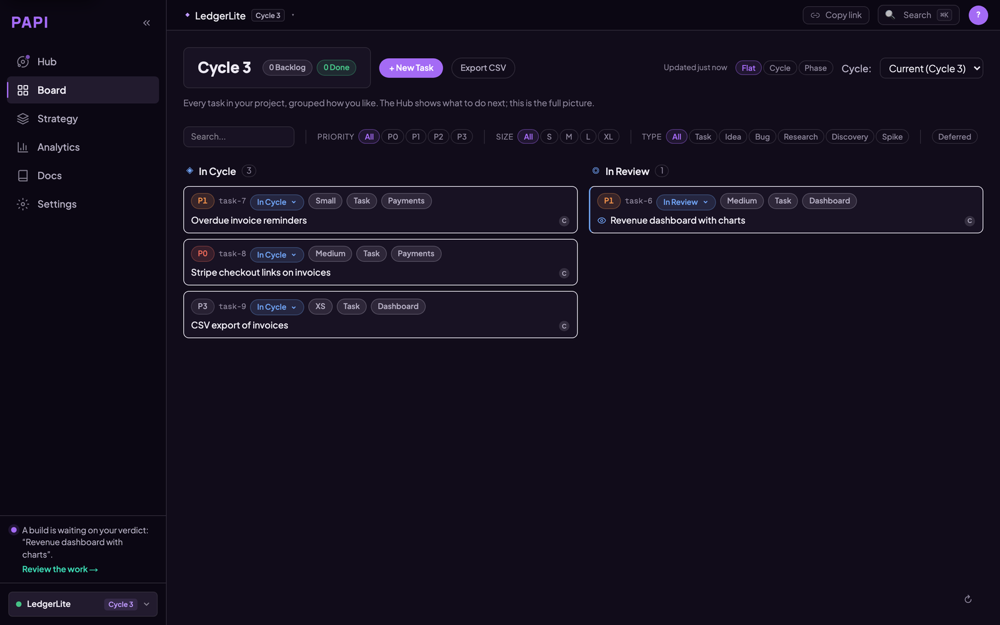
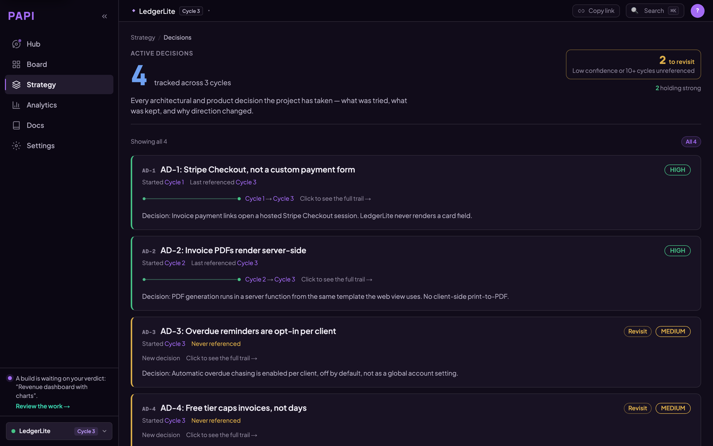
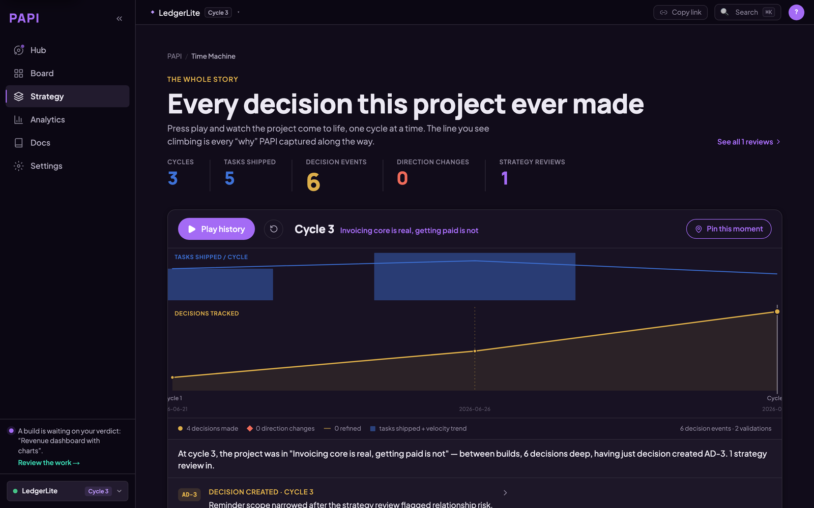

# PAPI

<!-- mcp-name: io.github.getpapi/papi -->

[](https://www.npmjs.com/package/@papi-ai/server)
[](https://registry.modelcontextprotocol.io/?search=io.github.getpapi%2Fpapi)
[](https://smithery.ai/servers/cathal/getpapi)
[](https://getpapi.ai/changelog)
[](https://github.com/getpapi/papi)
[](LICENSE)

**Your AI starts every session from zero. Your project stays on course.**



AI coding tools are great at writing code and terrible at holding a direction. Scope grows, plans change, and the decisions behind them get made in a chat window and lost there. PAPI keeps the project on course. It gives your assistant structured plan, build, review and release cycles, plus a decision trail recording what was chosen, what was dropped, and why. Your assistant writes and reads it while it works, so it stays current without anyone maintaining it.

You connect it once. From then on, your assistant starts every session knowing which cycle you're on, what's in flight, and what to do next.

**Free to start.** The whole plan → build → review → release loop, on up to three projects, no card. Free runs a real project start to finish; it isn't a trial. [Pricing](https://getpapi.ai/pricing).

> **What this repo is.** Documentation, install guides, and the issue tracker. PAPI's engine is closed source and hosted — you connect to it, you don't build it from here. The [`@papi-ai/server`](https://www.npmjs.com/package/@papi-ai/server) package on npm is the supported local runtime. The contents of this repo are MIT.

## Quick start

**Let your AI install it.** Paste this to your assistant — Cursor, Claude Code, Windsurf, Codex, VS Code, or any other MCP client:

> Read https://getpapi.ai/llms.txt and set up PAPI

That's the whole install. Your assistant reads the runbook for whichever tool it's running in and wires up the connection itself. (Same instructions live in this repo as [llms.txt](llms.txt) and [llms-install.md](llms-install.md) if your assistant can't fetch URLs.)

**Then authenticate — this part is yours.** PAPI signs in over OAuth, and no AI can click through a browser consent screen for you. Your assistant will tell you exactly where to click; until you do, the server sits at `Needs authentication` and no tool call will work. This is the step people miss.

Once you're connected, tell your assistant:

> Run the `setup` tool to scaffold this project, then run `orient` and tell me which cycle this project is on.

### Prefer to wire it up yourself?

In Claude Code, the shortest path is the plugin — two lines, nothing to copy or edit:

```
/plugin marketplace add getpapi/papi
/plugin install papi@papi
```

The plugin carries the server config, plus two skills: `check-mcp` diagnoses a connection that isn't working, and `papi-verify` health-checks the current cycle.

Every tool also takes the same streamable-HTTP endpoint directly, `https://mcp.getpapi.ai/mcp`. In Claude Code that's:

```
claude mcp add --transport http papi https://mcp.getpapi.ai/mcp
```

Either way, finish with `/mcp` → **papi** → **Authenticate**.

DeepSeek Harness users can install the repository-owned bundle after creating a PAPI connection token:

```text
dsh plugin --profile web add @papi-ai/deepseek-harness
```

See [PAPI for DeepSeek Harness](deepseek-harness/README.md) for token handling, verification, compatibility, and removal.

Per-tool config for Cursor, VS Code, Windsurf, Codex, and any generic MCP client is in [docs/install.md](docs/install.md).

## What you get

- **plan** breaks your goals into a cycle of right-sized tasks, each with a build handoff your assistant can execute directly.
- **build** tracks what was built, what surprised you, and what was discovered along the way.
- **review and release** close the loop, so every cycle feeds the next plan.
- **strategy reviews** every few cycles step back and check direction, not just velocity.
- **A dashboard** at [getpapi.ai](https://getpapi.ai) shows your cycles, board, and decisions, so you can see the state of the project without asking.

The methodology is the product: a plan, build, review, release loop your assistant runs with you, with memory that compounds. PAPI has been built with PAPI for every cycle in the badge above.



*The hub opens on one question — what happens next. The cycle's progress through plan, build, review and release sits under it.*



*The board is the full picture. Your assistant writes to it as a side effect of working, so it is current without anyone maintaining it.*

## How this differs from a tracker

**Unlike Linear, Jira, Asana or Notion,** this was not built for humans and then opened to agents. Those boards assume a human writes the ticket and a human reads it, in a tab your AI can't see. PAPI's board is written and read by your assistant as a side effect of working: starting a build opens the task, finishing it files the report, releasing closes the cycle. You approve the plan and you sign off the review. The ticket admin in between is the part that disappears. You manage the outcome, not the keystrokes.

**Unlike Taskmaster** and other in-repo task files, PAPI's state isn't a file one tool generates once and then drifts from. It's hosted and structured — cycles, build reports, review verdicts, and Active Decisions carrying confidence levels that change as evidence arrives. The same project memory is there from Claude Code, Cursor, VS Code, or Codex, so switching tools doesn't reset your context, and last cycle's learnings are an input to the next plan rather than something you have to remember to mention.

Neither of those is a knock on the tools. They're solving a different problem to the one that breaks every time your assistant opens a fresh window.



*Active Decisions are the part a task tracker has no field for: what was decided, why, what was rejected, and when to revisit it. Confidence moves as evidence arrives.*



*Every cycle leaves a trail, so the reasoning behind the project is still there months later — including for the assistant reading it back.*

## Tools

PAPI exposes these MCP tools to your assistant. The whole loop is a handful of calls.

**Core loop**
- **orient** — one call returns the current cycle, what's in flight, and the recommended next action. Run it at the start of every session.
- **setup** — scaffold PAPI onto a new project.
- **plan** — break goals into a cycle of right-sized tasks, each with a build handoff your assistant can execute directly.
- **build_list** — list the current cycle's tasks and their handoffs.
- **build_execute** — start a task (creates a branch and handoff) and complete it (records the build report).
- **review_list** / **review_submit** — surface finished builds and record accept / request-changes / reject verdicts.
- **release** — merge completed work and roll the cycle forward.

**Board and backlog**
- **board_view** — read the project board and any task.
- **board_edit** — change a task's status, cycle, priority, or notes.
- **ad_hoc** — record quick work done outside the cycle so it shows in project history.
- **idea** — capture a feature, bug, or research note into the backlog.
- **bug** — file a bug against the board.

**Strategy and intelligence**
- **strategy_review** — step back every few cycles to check direction, not just velocity.
- **strategy_change** — record an Active Decision, with supersede history.
- **zoom_out** — a periodic retrospective across many cycles.

**Docs and projects**
- **doc_register** / **doc_search** — register and find project reference docs.
- **project_list** / **project_switch** / **project_create** — manage multiple PAPI projects.

## Documentation

In this repo:

| Doc | What it covers |
|-----|----------------|
| [llms.txt](llms.txt) | The agent runbook — point your AI at this (live version: [getpapi.ai/llms.txt](https://getpapi.ai/llms.txt)) |
| [llms-install.md](llms-install.md) | Per-tool install instructions for AI assistants |
| [docs/install.md](docs/install.md) | Install paths for every supported tool |
| [docs/how-it-works.md](docs/how-it-works.md) | Cycles, handoffs, decisions, and how the pieces fit |
| [docs/troubleshooting.md](docs/troubleshooting.md) | Connection problems, project routing, common fixes |

Full documentation on the website — no account needed:

| Page | What it covers |
|------|----------------|
| [Quick Start](https://getpapi.ai/docs/guide/quick-start) | Zero to your first cycle plan in under 5 minutes |
| [Workflow](https://getpapi.ai/docs/guide/workflow) | The full plan → build → review → release loop |
| [Concepts](https://getpapi.ai/docs/guide/concepts) | Cycles, handoffs, Active Decisions — the vocabulary |
| [Cheat Sheet](https://getpapi.ai/docs/guide/cheat-sheet) | Every command on one page |
| [Tool Reference](https://getpapi.ai/docs/tools) | Every PAPI MCP tool with parameters and use cases |
| [Troubleshooting](https://getpapi.ai/docs/guide/troubleshooting) | Connection and auth first aid |
| [Handbook](https://getpapi.ai/docs/handbook) | For teams: reading dashboards, cycle reports, review flow |

## Community and support

Stuck, or something's broken? Open an issue — there are templates for each case, and the **connection problem** one is the one to reach for if PAPI won't connect or won't authenticate, which is where people get stuck most:

- [Connection problem](https://github.com/getpapi/papi/issues/new?template=1-connection-problem.yml) · [Bug report](https://github.com/getpapi/papi/issues/new?template=2-bug-report.yml) · [Question](https://github.com/getpapi/papi/issues/new?template=3-question.yml) · [Feature request](https://github.com/getpapi/papi/issues/new?template=4-feature-request.yml)
- [Discord](https://discord.gg/PbacBJ9fNw) is faster for questions, and release notes land there first.
- [CONTRIBUTING.md](CONTRIBUTING.md) covers what a useful report looks like and what a docs PR can change.
- Found a vulnerability? Don't open an issue — [SECURITY.md](SECURITY.md) has the private channel.

### Star the repo

If PAPI is useful to you, [star it](https://github.com/getpapi/papi). That's the whole ask, and it's how other people building with AI assistants find it.

## Links

- Website and dashboard: [getpapi.ai](https://getpapi.ai)
- Pricing: [getpapi.ai/pricing](https://getpapi.ai/pricing) — free tier, no card
- What shipped in each cycle: [getpapi.ai/changelog](https://getpapi.ai/changelog)
- Data, access, and what PAPI doesn't have yet: [getpapi.ai/trust](https://getpapi.ai/trust)
- **Licence:** the contents of this repo (docs, guides, config examples, Dockerfile) are MIT. That licence covers this repository only — not the PAPI engine, and not the PAPI name or logo, which are trademarks.
